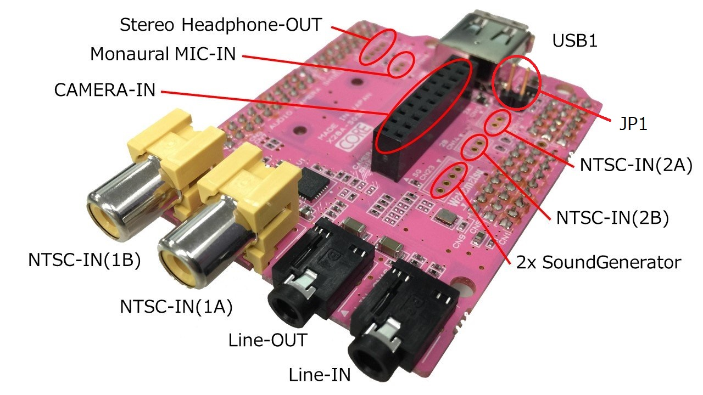
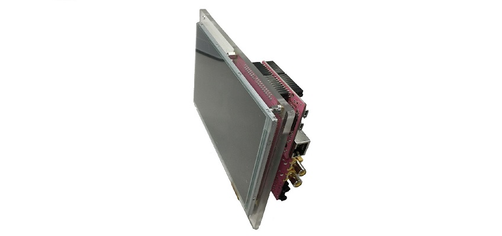
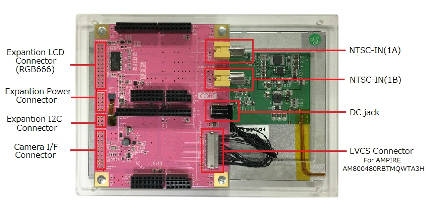
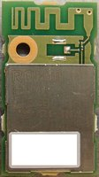

## Gr Peach board
- Software:
    + Main page: [mbed](https://developer.mbed.org/platforms/Renesas-GR-PEACH/)
    + Library [mbed](https://developer.mbed.org/handbook/Homepage#using-mbed-libraries)
    + Supported function map [mbed](https://developer.mbed.org/teams/Renesas/wiki/GR-PEACH_supported_function_map). Note: LCD, Audio In/out library was supported but mbed RTOS needed.
- To be able to build the example by mbed compiler online
```
#Select and add GrPeach board to mbed compiler 
https://developer.mbed.org/platforms/

#Install USB communication driver to PC (for Windows only). 
#Mbed serial port work default on linux
https://developer.mbed.org/handbook/Windows-serial-configuration

#Import project at mbed compiler online or mbed site
https://developer.mbed.org/compiler/

#Compile and download binary file to mbed driver on PC
#-> press reset button -> run
```

- To be able to build the example by mbed compiler offline with DS-5 and GCC ARM Compiler: [info](https://developer.mbed.org/teams/Renesas/wiki/Exporting-to-GCC-ARM)

```
# Install GCC ARM Embedded, make (only for Windows)

# Install DS5: . Active by code generate in DS5 for renesas kit
http://ds.arm.com/renesas/

# Build DS5 enviroment:
# 1. Open DS5. Select [Window] [Preference] and [DS-5] [Configuration Database]. 
# Add reference to ./Software/configdb_v519-20150327/configdb. Rebuild database.
# 2. Create debug configuration: TBD (when board is available)
```
    

- For more information
    + [mbed compiler online](https://developer.mbed.org/teams/Renesas/wiki/GR-PEACH-Getting-Started)
    + [mbed export to Ds5](https://developer.mbed.org/teams/Renesas/wiki/Exporting-to-GCC-ARM)
    + [Update Firmware for Gr board](https://developer.mbed.org/teams/Renesas/wiki/How-to-update-firmware-for-GR-PEACH)
    + [other know how database](https://developer.mbed.org/teams/Renesas/wiki/GR-PEACH-knowhow-database)
    + Debug in mbed: 
        * use printf (don't use in interrupt context) [printf function](https://docs.mbed.com/docs/mbed-os-handbook/en/latest/debugging/printf/#printf-from-an-interrupt-context "ref1"), [CMSIS-RTOS](https://developer.mbed.org/handbook/CMSIS-RTOS "ref2")
    + mbed interface [DAPLink](https://docs.mbed.com/docs/mbed-os-handbook/en/latest/advanced/DAP/ "DAPLink"), [git repo](https://github.com/mbedmicro/DAPLink/blob/master/README.md "git repo")
    + Gr-Peach-BSP [ref1](http://elinux.org/RZ-A/Boards/GR-PEACH-bsp)

- Hardware:
    + Schematic [revision E (X28A-M01EF)](https://drive.google.com/open?id=0B_p_VcQ0E_k5M0I5dVgyZ2lkQ0E)
    + Jumper setting: [link](https://developer.mbed.org/teams/Renesas/wiki/Jumper-settings-of-GR-PEACH)
- For more info
    + [Core Hardware site](http://www.core.co.jp.e.ko.hp.transer.com/product/m2m/gr-peach/index.html)

## MCU
- MCU [RZ/AH1](https://www.renesas.com/en-sg/products/microcontrollers-microprocessors/rz/rza/rza1h.html), part [R7S721001VCBG](https://www.renesas.com/en-sg/products/microcontrollers-microprocessors/rz/rza/rza1h/device/R7S721001VCBG.html)
- Hardware
    + manual: [link](https://drive.google.com/open?id=0B_p_VcQ0E_k5OVpTVURiNlpwblk)
- Software:
    + Boot process: [info](./Software/Boot_RZA1H.md)
    + Development tool:
        * [e2 studio](https://www.renesas.com/en-us/products/software-tools/tools/ide/e2studio.html)
        * [mbed compiler](https://developer.mbed.org/handbook/mbed-Tools)
        * [mbed compiler offline](http://hamblen.ece.gatech.edu/2036/Using%20the%20offline%20compiler%20with%20mbed%20at%20Georgia%20Tech.htm)       

## Audio camera shield [link](https://developer.mbed.org/teams/Renesas/wiki/Audio_Camera-shield)

- Solution for Audio [ref](https://www.renesas.com/en-sg/solutions/automotive/audio/display.html)

## LCD Shield, [link](https://developer.mbed.org/teams/Renesas/wiki/LCD-shield)



## BP3595 WiFi module [link](https://developer.mbed.org/components/BP3595-for-GR-PEACH/)
