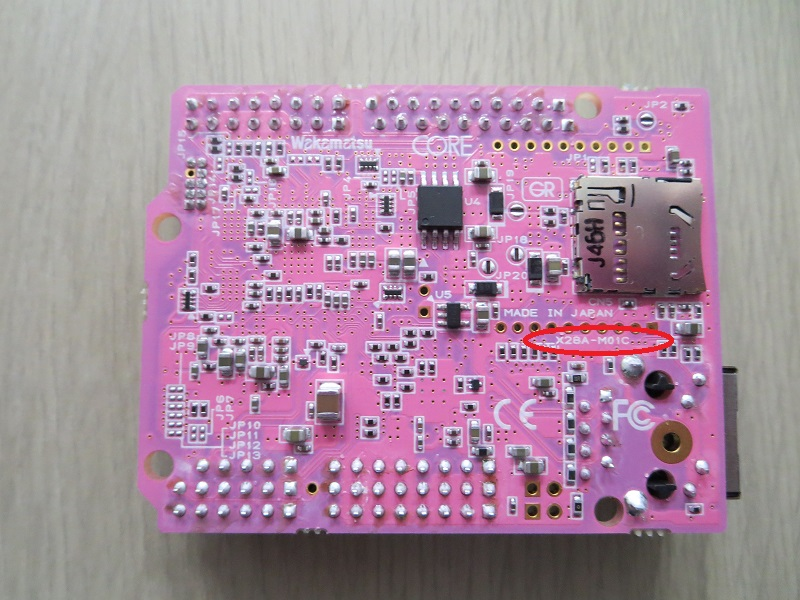

## Gr Peach board
- Software:
    + Main page: [mbed](https://developer.mbed.org/platforms/Renesas-GR-PEACH/)
    + Library [mbed](https://developer.mbed.org/handbook/Homepage#using-mbed-libraries)
    + Supported function map [mbed](https://developer.mbed.org/teams/Renesas/wiki/GR-PEACH_supported_function_map). Note: LCD, Audio In/out library was supported but mbed RTOS needed.
    + To be able to build the example by mbed compiler online
```
#Select and add GrPeach board to mbed compiler 
https://developer.mbed.org/platforms/

#Install USB communication driver to PC (for Windows only). 
#Mbed serial port work default on linux
https://developer.mbed.org/handbook/Windows-serial-configuration

#Import project at mbed compiler online or mbed site
https://developer.mbed.org/compiler/

#Compile and download binary file to mbed driver on PC
#-> press reset button -> run
```

    + To be able to build the example by mbed compiler offline with DS-5 and GCC ARM Compiler: [info](https://developer.mbed.org/teams/Renesas/wiki/Exporting-to-GCC-ARM)
```
# Install [GCC ARM Embedded](https://launchpad.net/gcc-arm-embedded/4.9/4.9-2015-q3-update), [make](https://www.cygwin.com/) only for Windows

# Install DS5: [win64](https://silver.arm.com/download/download.tm?pv=1688510), [linux64](https://silver.arm.com/download/download.tm?pv=1688514). Active by code generate in [DS5 for renesas kit](http://ds.arm.com/renesas/)

# Build DS5 enviroment:
# 1. Open DS5. Select [Window] [Preference] and [DS-5] [Configuration Database]. Add reference to ./Software/configdb_v519-20150327/configdb. Rebuild database.
# 2. Create debug configuration: TBD (when board is available)
```
    
+ Debug in mbed: 
        * use printf (don't use in interrupt context) [printf function](https://docs.mbed.com/docs/mbed-os-handbook/en/latest/debugging/printf/#printf-from-an-interrupt-context "ref1"), [CMSIS-RTOS](https://developer.mbed.org/handbook/CMSIS-RTOS "ref2")
+ mbed interface [DAPLink](https://docs.mbed.com/docs/mbed-os-handbook/en/latest/advanced/DAP/ "DAPLink"), [git repo](https://github.com/mbedmicro/DAPLink/blob/master/README.md "git repo")

+ For more information
    * [mbed compiler online](https://developer.mbed.org/teams/Renesas/wiki/GR-PEACH-Getting-Started)
    * [mbed export to Ds5](https://developer.mbed.org/teams/Renesas/wiki/Exporting-to-GCC-ARM)
    * [Update Firmware for Gr board](https://developer.mbed.org/teams/Renesas/wiki/How-to-update-firmware-for-GR-PEACH)
    * [other know how database](https://developer.mbed.org/teams/Renesas/wiki/GR-PEACH-knowhow-database)

- Hardware:
    + Schematic
        * [revision E (X28A-M01E)](https://developer.mbed.org/media/uploads/1050186/x28a-m01-ef.pdf), [revision C (X28A-M01C)](https://developer.mbed.org/media/uploads/1050186/x28a-m01-cd.pdf). 
        * [revision B(X28A-M01B)](http://www.core.co.jp/product/m2m/gr-peach/pdf/history/gr-peach_circuit_b.pdf). 
    + Jumper setting: [link](https://developer.mbed.org/teams/Renesas/wiki/Jumper-settings-of-GR-PEACH)

## RZ/AH1 MCU [link](https://www.renesas.com/en-sg/products/microcontrollers-microprocessors/rz/rza/rza1h.html)
- Software:
    + Boot process: [info](./Software/Boot_RZA1H.md)
    + Development tool:
        * [e2 studio](https://www.renesas.com/en-us/products/software-tools/tools/ide/e2studio.html)
        * [mbed compiler](https://developer.mbed.org/handbook/mbed-Tools)
        * [mbed compiler offline](http://hamblen.ece.gatech.edu/2036/Using%20the%20offline%20compiler%20with%20mbed%20at%20Georgia%20Tech.htm)       
- Hardware
    + manual: [link](https://www.renesas.com/en-sg/doc/products/mpumcu/doc/rz/r01uh0403ej0300_rz_a1h.pdf?key=c9238be3bc64539027cf8b0d5eb5b0d8)

## Audio camera shield, [link](https://developer.mbed.org/teams/Renesas/wiki/Audio_Camera-shield)


## LCD Shield, [link](https://developer.mbed.org/teams/Renesas/wiki/LCD-shield)


## BP3595 WiFi module, [link](https://developer.mbed.org/components/BP3595-for-GR-PEACH/)
