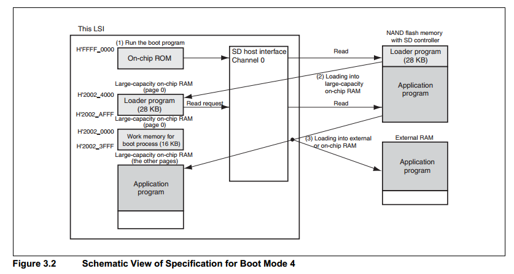

## Boot Overview
- Example: 
    + Boot sequence on STM32F4: [info](https://feabhas.gitbooks.io/stm32f4-cmsis/content/the_boot_sequence.html)

## Boot process on RZ/A1H

| MD_BOOT2 | MD_BOOT1 | MD_BOOT0 | Boot Mode
| --- | --- | --- | --- |
| x | 0 | 0 | Boot Mode 0 (CS0-space 16-bit booting)
| x | 1 | 0 | Boot Mode 1 (CS0-space 32-bit booting)
| 1 | 0 | 1 | Boot Mode 3 (serial flash booting)
| 0 | 1 | 1 | Boot Mode 4 (eSD booting)
| 1 | 1 | 1 | Boot Mode 5 (eMMC booting) 

- Boot mode 0 & 1: 
    + After PoR, MCU excute boot program stored in the memory (H'0000 0000) connected to the CS0 space. 
- Boot mode 3 (flash): booting up is from serial Flash mermory with SPI controller. 
    + After PoR, MCU excute boot program stored in on-chip ROM (H'FFFF 0000). 
- Boot mode 4 & 5 (eSD or eMMC): booting up is from NAND Flash memory with SD controller (channel 0). 
    + Init SD (MMC) host interface channel 0 (TBD)
    + After PoR, MCU excute boot program stored in on-chip ROM (H'FFFF 0000). Boot program transfers 28KBytes of *loader program* (TBD) from NAND flash to on-chip RAM (Add: H'2002 4000 to H'2002 AFFF)
    +  *Loader program* transfer application program from NAND flash to on-chip RAM (Add: H'2002 0000 to H'2002 3FFF) or external RAM.
  

## FOTA Overview
- Basic step in FOTA:
    + Download a new image via network connection (Bluetooth, Wifi,..). Image will store in external EEPROM, Flash,..
    + Once, image is complete. CRC check is done to verify this external image
    + MCU is RESET -> enter a bootloader updater that erase the main memory and transfer external image to MCU.
    + Once, CRC check is done to verify the internal image. MCU jump back to main application. 


## Reference Information
- Boot in embedded. [info](http://www.embedded.com/design/mcus-processors-and-socs/4008796/Fundamentals-of-Booting-for-Embedded-Processors)
- Boot in ARM based MCU 
    + [info1](https://www.embeddedrelated.com/showarticle/118.php)
    + [info2](http://blog.techveda.org/arm-linux-booting-process/)
    + [info3](http://beningo.com/understanding-the-microcontroller-boot-process/)
- Edit Boot in legacy GRUB:
```sh
# Edit /etc/grub.conf
# Reboot
```

- Edit Boot in GRUB2:
```sh
# Edit /etc/sysconfig/grub
# Run grub2-mkconfig to update to /etc/grub2.cfg or /etc/grub2-efi.cfg
# Reboot
```

- Boot in RCar (CONFIDENTIAL)
- Boot in RZA1H
